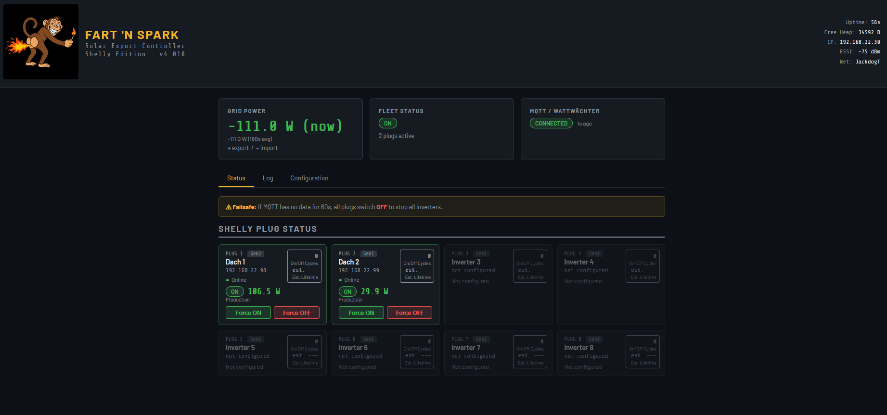

# Fart 'N Spark ⚡

**Solar export controller for ESP8266 (Wemos D1 Mini) + Shelly plugs**

Reads grid power from a WattWächter energy meter via MQTT and automatically switches up to 8 PV inverters on and off to keep grid export below a configurable threshold. Will work with any type of single phase inverter. Up to 8 Shelly plugs (Gen 1/2/3) supported.

---

## What it does

- Subscribes to an MQTT topic for live grid power (W)
- Maintains a moving average to filter out appliance and cloud shadow noise
- Switches inverters ON when importing, OFF when exporting above threshold
- Best-fit plug selection — one plug per cycle, closest match to available headroom
- Fault detection — flags plugs that don't respond to commands
- AP fallback — if Wi-Fi fails, starts a config access point at `192.168.4.1`
- Web UI with status, log, heap monitor, and full configuration

## Hardware

- Wemos D1 Mini (ESP8266, 4 MB flash)
- Shelly Plug S / Plus Plug S / Shelly switches (Gen 1, 2, or 3)
- WattWächter (Tasmota energy meter publishing MQTT)

## Programming with webflasher (easiest)
Flash via browser (ESP Web Tool)
No software install needed — works in Chrome or Edge only (not Firefox).

Download newest bin file 
Go to https://esp.huhn.me
Click Connect → select your Wemos D1 Mini COM port
Click Add file → set address to 0x0 → select the .bin file
Click Program — takes about 30 seconds

After flashing, the device boots into AP mode. Connect to FartNSpark and check the Serial Monitor for the AP password.

## Quick start

1. Flash `deye_shelly_8266V1_v4011.ino` or newer file via Arduino IDE  or Webflasher (see above)
2. Connect to Wi-Fi AP **FartNSpark** — check Serial Monitor for password
3. Browse to `http://192.168.4.1` — enter Wi-Fi and MQTT settings
4. Add your Shelly plug IPs and inverter nominal power
5. Done — the controller starts automatically on first MQTT message

> ⚠️ Mains voltage is involved. Installation by a qualified electrician only. See the full manual for safety and legal notices.

## Docs

See [FartNSpark_Manual_v4010.md](FartNSpark_Manual_v4010.md) for full documentation including configuration reference, algorithm description, API, and troubleshooting.

---

*Open-source, no warranty. Use at your own risk.*

---

## Disclaimer

This firmware is provided for educational and experimental purposes only. It involves control of mains-voltage equipment (230 V AC). The author accepts no liability for damage to property, injury, or death resulting from its use. Installation must be carried out by a qualified electrician in accordance with all applicable local regulations. Use entirely at your own risk.

See [FartNSpark_Manual_v4010.md](FartNSpark_Manual_v4010.md) for the full safety and legal notice before installing.

## License

MIT © hellebauer

